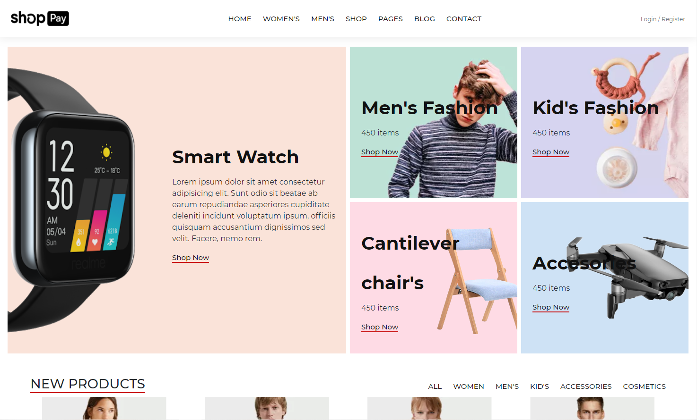
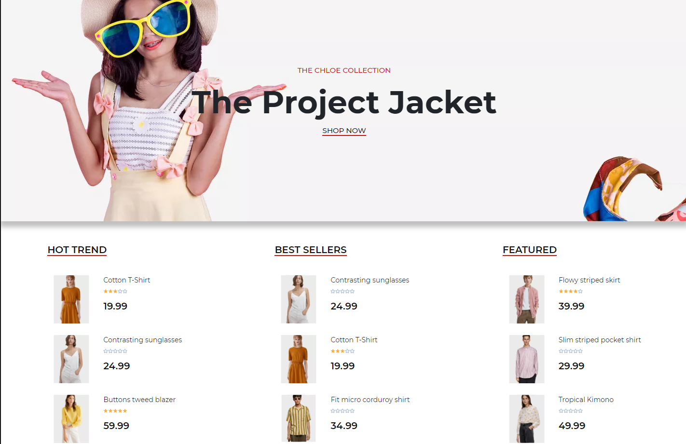
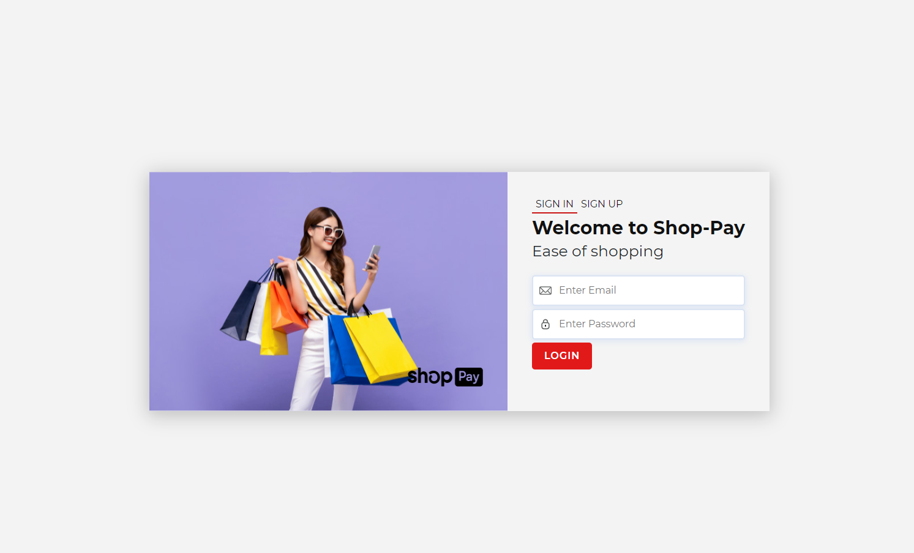
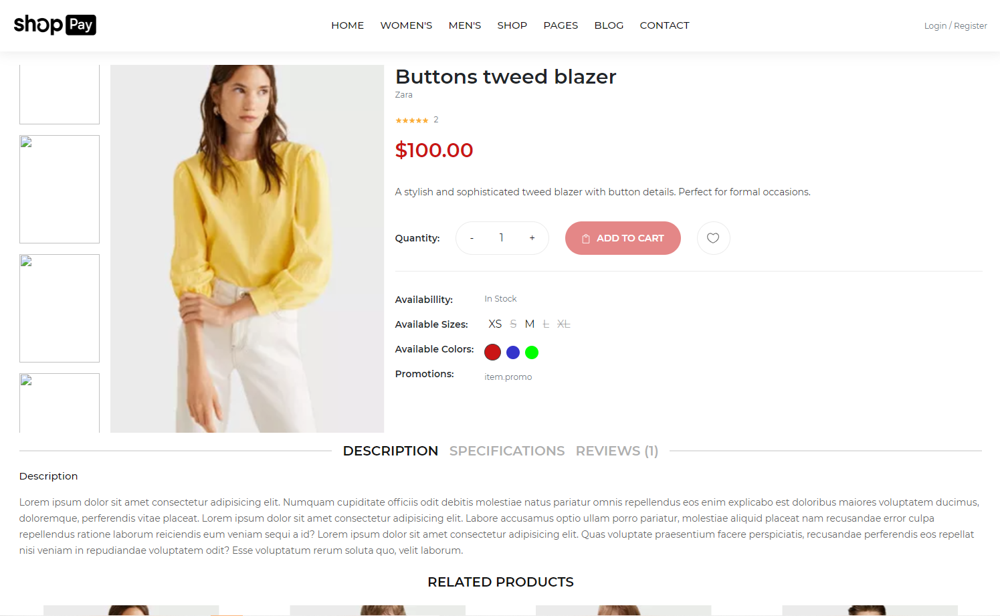
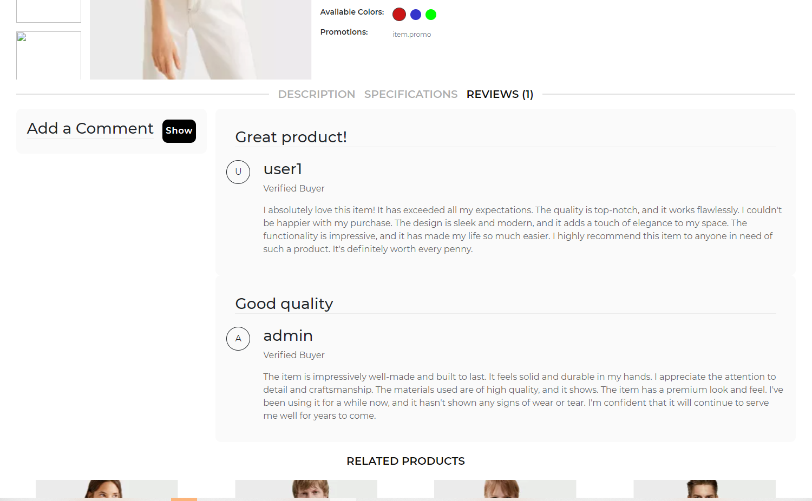
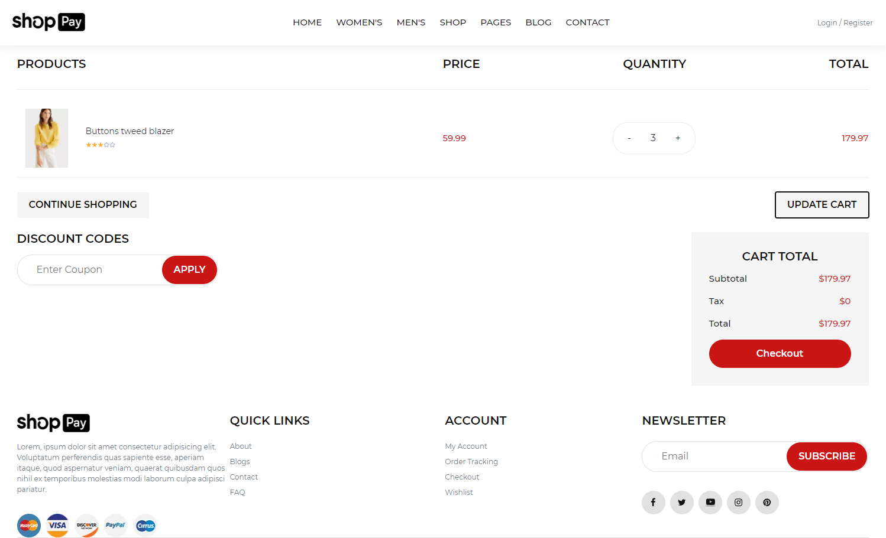

# Shop-Pay

Shop-Pay is a full-stack website that offers a convenient platform for purchasing products. Whether you're just browsing our catalogue or intending to make a purchase, our user-friendly design will not disappoint.

The Shop-Pay website features a database of products ranging from glasses to jackets.

The landing page welcomes users with a catalogue of categories to choose from. Users can scroll down to find newly added products.

Once users have found their desired product, they can view detailed information about the product. Clicking on a product directs them to the single page which showcases its price, variations, specifications, and reviews. The single view page provides a functional availability system for viewing available variations of colors and sizes. This process utilizes a map for quick operations and efficiency. Users can also view a review section with feedback from previous buyers. Users can leave a meaningful review with a bold header, rating, and a brief description.

The checkout process is straightforward, guiding users through their cart items. Although payment processing is not currently available, the system still creates the purchase and updates the product's purchase count.

Experience the convenience and flexibility of buying products with Shop-Pay. Explore our vast selection of products and purchase with confidence.

## Technologies Used

- **Front-end**: HTML, CSS, JavaScript, React, Redux, Bootstrap
- **Back-end**: Node.js, Express.js, MongoDb
- **Authentication**: bcrypt, JWT (JSON Web Tokens)
- **Other Tools**: Git, GitHub, Postman

## Installation

To run the project locally, follow these steps:

1. Clone the repository.
2. Install the dependencies using npm or yarn.
3. Set up the database and configure the connection.
4. CD to the server and run the seeds
4. Start the development server.
5. Access the website through your preferred browser.

## Pages

### Landing Page

*Figure 1: Landing Page*

The user is greeted with some images and categories

### New Products

*Figure 2: New-Products Section*

Users can scroll down and find a section for newly added products.

### Banner-Analytics

*Figure 3: Banner-Analytics Section*

A banner with a picture that has no fucntion. The HotTrends, BestSellers, and Featured are calculated based on a model and route on the server.

### Login

*Figure 4: Login Page*

Users can log in or sign up securely.

## Single View

*Figure 6: Single View*

Users can click on a product and be directed to a single view of that product, where they can get more information. They can check functional available variations that are stored in the database.

## Reviews

*Figure 8: Review Section*

Users can view reviews made by other users, delete reviews, or add new reviews. The total number of reviews is indicated at the top. Users can rate the product from 1 to 5 stars, add a title, and provide a description. A user can view 3 views at once and have a choice to load more.

## Checkout

*Figure 9: Checkout Page*

When users have found their desired product/ products and selected their variation, they can proceed to the checkout process. Although there is no current payment processing.

## License

This project is licensed under the MIT License - see the [LICENSE](LICENSE) file for details.

## Credits

- Express: The server framework used for handling HTTP requests and API endpoints. Express
- React Router: The library used for client-side routing and navigation. React Router
- jsonwebtoken: The library used for generating and verifying JSON Web Tokens (JWT) for user authentication.
- MongoDb: The non-relational database management system used for storing and retrieving data.
- Redux: The library used for managing state in React applications. Redux
- react-redux: The official Redux bindings for React, used for integrating Redux with React components. 
- Bootstrap: The framework used to quicky style and manage my containers.